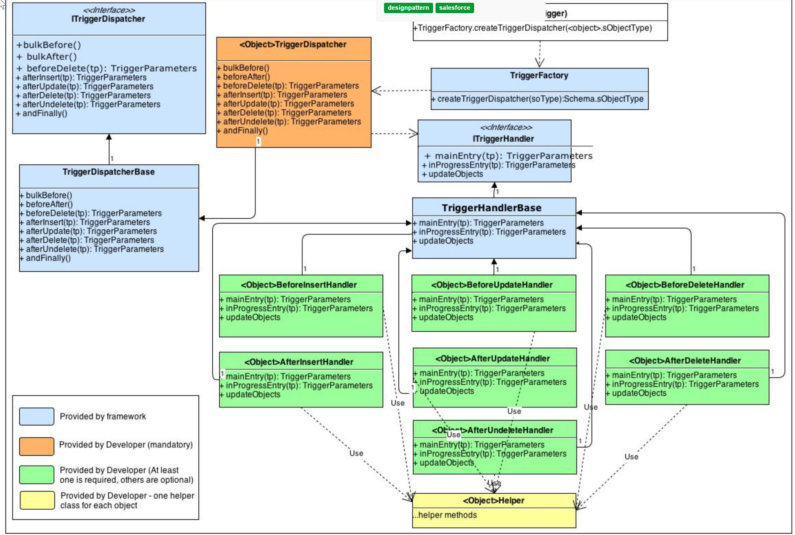
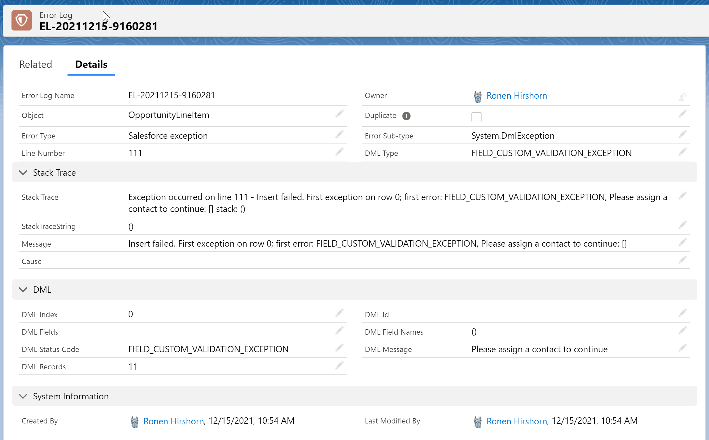
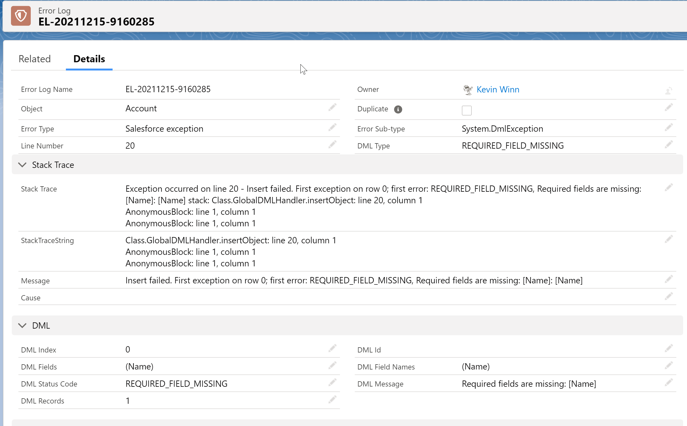
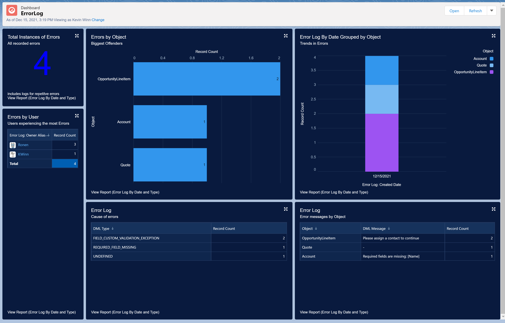

# SF_TriggerFramework
## Open Source Components
### Apex-Trigger-Architecture-Framework
Issued under Apache License 2.0  [Link to Source](https://code.google.com/archive/p/apex-trigger-architecture-framework/)

 - Provides natural separation of concerns by trigger context for each sObject it is deployed for
 - Extended to include 
     - AccessControls.cls
       - Security class for handling CRUD and FLS checks
     - GlobalDMLHandler.cls 
       - DML handler that manages limits and access controls gracefully
     - LoggingHandler.cls
       - Custom logging for reporting on errors and access control issues

 ## Error Log Custom Object
 Stores all captured errors and access control violations generated by DML operations handled by GlobalDMLHandler.cls and LoggingHandler.cls

 ### Examples

 #### Custom Validation Errors

#### Missing Required Fields

#### List Exceptions

## Dashboard Example 

## Includes

 - Test Data Factory and Unit Tests
 - Batch and Scheduling Classes to Purge Aged Logs